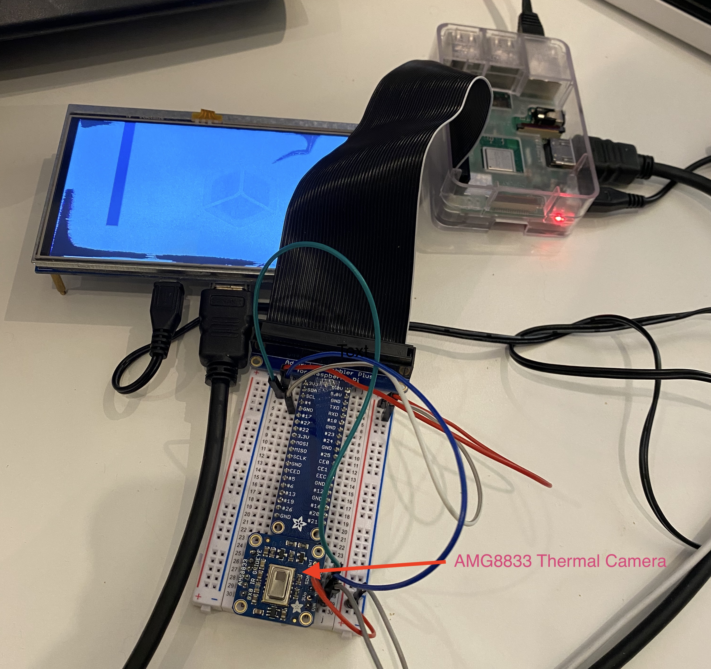

# Open-Source Fever Spotter

I'm building a device that can identify humans passing by, and check to see if their temperature is elevated. If we find someone with an elevated temperature, it will alert someone (via flashing light / webhook / a siren), and capture a photograph of the person.



## Parts List
- Raspberry Pi
- MLX90640 Thermal Camera Breakout
- Pi-compatible Camera
- HDMI-driven LCD screen

## Development
[Useful Reading](https://docs.balena.io/learn/getting-started/raspberrypi3/python/)

### Generating your Dev Environment:
1. Clone this repository to your computer.
  ```
  $ git clone git@github.com:Fever-Tracker/thermal-pi.git
  ```
2. Visit the [Balena Dashboard](https://dashboard.balena-cloud.com/apps), and create a new Application. The settings should as follows:
    - Application Name: Whatever you want, might be nice to put your name on it.
    - Default Device Type: Raspberry Pi 3
    - Application Type: Starter
3. Install the [Balena Client](https://docs.balena.io/reference/cli/) on your laptop:
  ```
  $ npm install balena-cli -g --production --unsafe-perm
  ```

4. Install Docker (version [18.06.1-ce, build e68fc7a](https://download.docker.com/mac/stable/26764/Docker.dmg))
   Note: the newest version of Docker will not work. Don't update your Docker!
   Balena's preload function is dependent on the AUFS feature, which has been deprecated.

5. Login to your balena account
  ```
  $ balena login
  ```
6. Upload a code release to your application
  ```
  $ cd {into location of your gateway repo}`
  $ balena push {name of your Application}
  ```

7. Navigate back to 'Devices', click 'Add device', select the following settings, and Download your SD card image:
    - Device Type: Raspberry Pi 3
    - BalenaOS Version: latest is okay
    - Select Edition: Development (this is preferable for development b/c you can ssh into the device directly. [More details on differences between the two editions](https://www.balena.io/docs/reference/OS/overview/2.x/#dev-vs-prod-images) can be found here.)
    - Network Connection: Ethernet Only is preferable if you are developing the wifi-connect flow, though the wifi connect portal will initiate regardless of what you choose, as it looks at whether the pi's configuration variables are set.
8. Burn the image onto an SD card. I like to use [Etcher](https://etcher.io/) for that.
9. Plug in your SD card into your Raspberry Pi and boot it up!
12. Connect your Pi to internet directly via an ethernet cable (try this guide if you want to share internet with the Pi from your computer: [Guide](https://docs.google.com/document/d/1B5JYJ1PMyXNR5i3XrQWhAyxod55W-T_gWoo5nRfHD1o/edit?usp=sharing).
